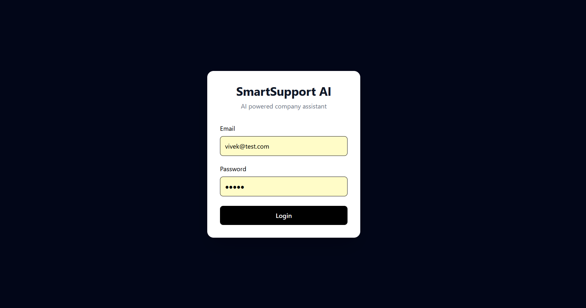
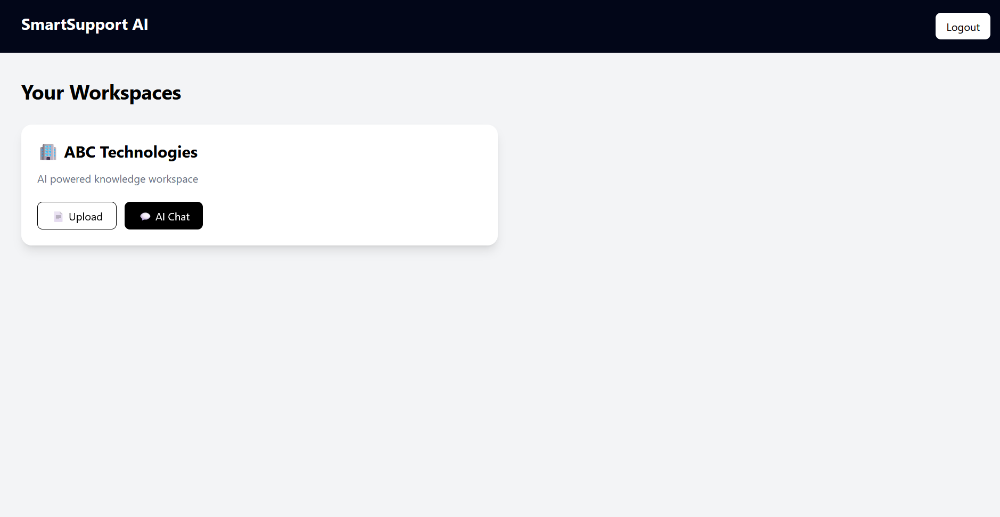
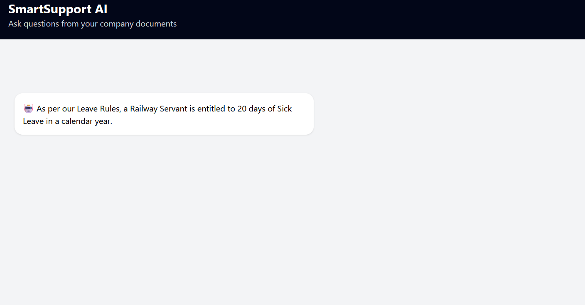

# 🤖 SmartSupport AI

AI powered customer support platform where companies can upload documents and create their own AI assistant.

## 🚀 Features

- User Authentication using JWT
- Multi Company Workspace Support
- PDF Knowledge Base Upload
- AI Question Answering
- Retrieval Augmented Generation (RAG)
- Local LLM Support with Ollama
- Chat History
- Secure APIs


## 🛠 Tech Stack

### Frontend
- React
- Tailwind CSS
- Axios

### Backend
- FastAPI
- Python
- MongoDB

### AI
- Ollama
- Llama Model
- ChromaDB
- Sentence Transformers


## 📸 Screenshots

### Login




### Dashboard




### AI Chat




## 🧠 Architecture

```text
React Frontend

      ↓

FastAPI Backend

      ↓

----------------
|              |
MongoDB     ChromaDB

               ↓

          Ollama LLM

               ↓

        AI Response
```

## Status

MVP Completed ✅